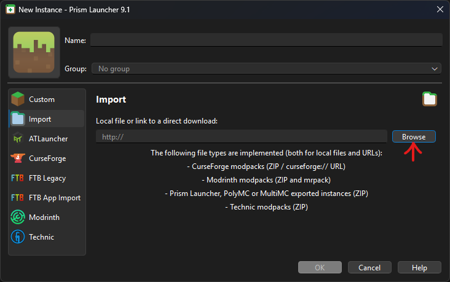

# Vanilla MineCraft Instance

## Instructions

### Cloning the Repository

Click on the "Code" button: 

Download the repository as a ZIP file: .

Extract the file to a place you can find later.

### Installing the JRE

We will use Eclipse Temurin JRE 21.0.5, this can be installed in Windows Terminal
using the following command:

```sh
winget install EclipseAdoptium.Temurin.21.JRE
```

Or grab the installer from: [https://github.com/adoptium/temurin21-binaries/releases/download/jdk-21.0.5%2B11/OpenJDK21U-jdk_x64_windows_hotspot_21.0.5_11.msi].

# Installing the Launcher

We will be using Prism Launcher, this can also be installed in Windows Terminal
with:

```sh
winget install PrismLauncher.PrismLauncher
```

Or grab the installer from [https://github.com/PrismLauncher/PrismLauncher/releases/download/9.1/PrismLauncher-Windows-MSVC-Setup-9.1.exe].

### Importing the Instance

Open up PrismLauncher and sign in to your Microsoft account, then, click "Add
Instance" in the top menu: 

Click "Import": 

Click "Browse": 

Navigate to wherever you saved the cloned repository and open `vanilla.zip`.

### Play

Now go and waste hours of your precious life playing a child's game.
